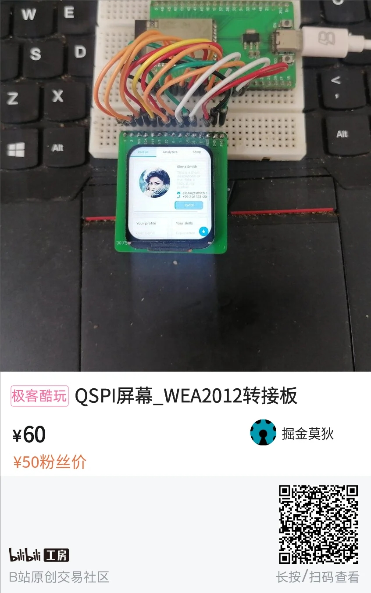
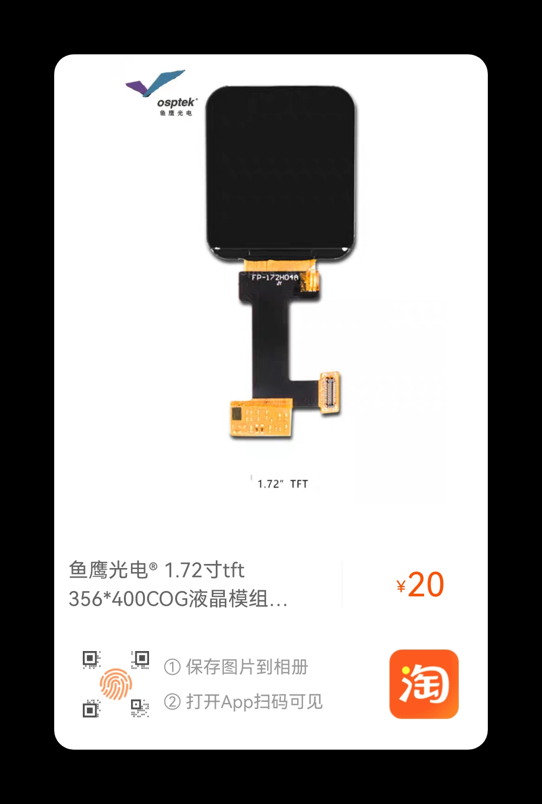

```
仅适用WEA2012
分辨率356*400
接口：QSPI+I2C
```

# 仅适合esp32s3,其他esp32系列(esp32,esp32s2,esp32c3,esp32c6等)并没有测试，所以不确定。

# QSPI屏幕_WEA2012转接板购买链接(包含屏幕)

[购买链接](https://mall.bilibili.com/neul-next/index.html?page=mall-up_itemDetail&noTitleBar=1&itemsId=1103222126&from=items_share&msource=items_share)



# 单独屏幕购买链接

